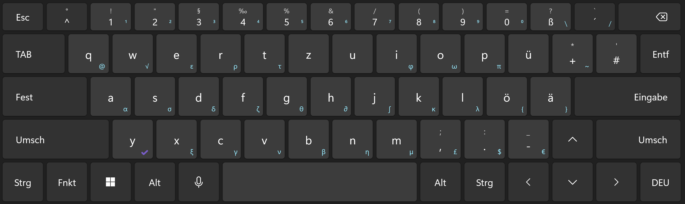
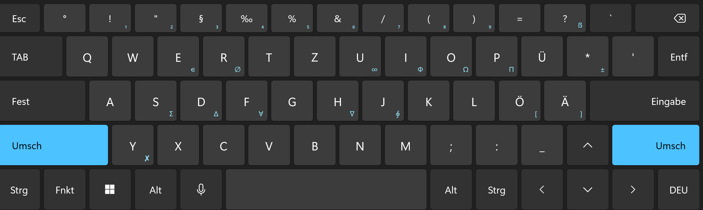
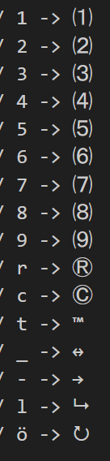
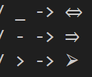
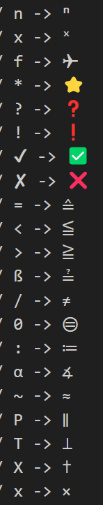

# keyboard-layout

This is my personal keybard layout I use daily on my pc. It includes many mathematical symboles you could need. Its based on the German QWERTZ layout with many additions. It mostly just adds new keybinds but there are a few Keys that I've put somwhere else, namely are "€","$" and brackets "{","[","]","}" curencies are now all sorted at the bottom right and brackets are mooved to ä&ö which makes it easier to reach them when coding.

## installation 
1. run the .exe in the zip file. It is autogenerated by [MSKLC](https://www.microsoft.com/en-us/download/details.aspx?id=102134)
2. Go to Settings → Time & language → Language & region 
3. click on the 3 dots next to German (Germany) [if not shown install the Geman Language Pack by clicking "Add a language"] and select language options
4. click "Add a Keyboard" and select "German - Custom V10 by afffe18  [...]"

To uninstall simply run the .exe again

## content
lowercase  &  AltGr (blue)

  

 

uppercase  &  Shift+AltGr (blue)

  

 

I also took advantage of modifier keys like " ´ ", " ` " and " ^ " (picures below in that order). I know that some of them aren't needed but I decided to include them anyways.

  
  
  

## List of all currently added caracters:

αβγδεζθφκλµηωπρστνξ ΦΩΣΠ

√∫∮∂∇ Δ∀∈∅∞‰ ±∙ ≔≟≧≦≙≈⊜∡∥⊥≔≟

✔✘✅❌❗❓⭐✈✝ ↔→⮡ ⭮⇔⇒⮚

¹²³⁴⁵⁶⁷⁸⁹⁰₁₂₃₄₅₆₇₈₉ˣⁿ ⑴⑵⑶⑷⑸⑹⑺⑻⑼ ⓇⒸ™

çÇ £¥

 

---
feedback and questions are welcome !