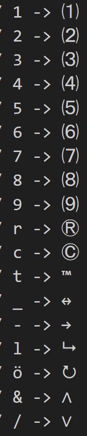
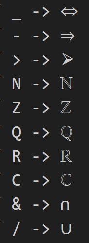
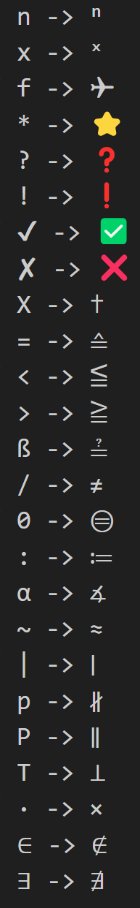

# Advanced QWERTZ Keyboard Layout for engineers

This is my personal keyboard layout I use daily on my pc. It includes many mathematical symbols you could need and much more as listed at the bottom. Its based on the **German QWERTZ** layout with many additions. It mostly just adds new keybinds but there are a few keys that I've put somewhere else, namely "€", "$" and brackets "{", "}", "[", "]" currencies are now all sorted at the bottom right corner of your keyboard and brackets are moved to "ä" & "ö" which makes it easier to reach them when coding. Both can be archievd by combinge the key with AltGr. This was necessary to allow all numbers to be printed as sub- & superscript. 
For a full list of all currently added characters scroll down.

## Installation 
1. Run the .exe in the zip file. (It's auto generated by [MSKLC](https://www.microsoft.com/en-us/download/details.aspx?id=102134))
2. Go to Settings → Time & language → Language & region 
3. Make sure German is a the top of the list, to be used as default
4. Click on the 3 dots next to German (Germany)  and select language options [if German is not listed install the German Language Pack by clicking "Add a language"]
5. click "Add a Keyboard" and select "German - Custom V[...]" and make sure its at the top of the list

To uninstall simply run the same .exe again

## Content
Most symbols can be archieved by combining them with _AltGr_ (= _Ctrl_ + _Alt_). The two pictures below show the layout. The first one is just all lowercase letters (white) and in combination with the _AltGr_ key (blue). The bottom one is the same but in combination with _SHIFT_

  

  

 

I also took advantage of modifier keys like " ´ ", " ` " and " ^ ". I know that some of the archieved symbols aren't necessary but I decided to include them anyways:

  

    <h2>" ´ "</h2>
    
  

  

    <h2>" ` "</h2>
    
  

  

    <h2>" ^ "</h2>
    
  

## List of all currently added characters

α β γ δ ε ζ θ φ κ λ µ η ω π ρ ϱ σ τ ν ξ &nbsp;&nbsp;&nbsp;&nbsp; Φ Ω Σ Π ψ

√ ∫ ∮ ∂ ∇  &nbsp;&nbsp;&nbsp;&nbsp;   ∀ ∃ ∄ ∈ ∉ ∧ ∨ ∩ ∪ ∣ &nbsp;&nbsp;&nbsp;&nbsp; ℕ ℤ ℚ ℝ ℂ

Δ ∅ ∞ ‰ ± ∙ ×  &nbsp;&nbsp;&nbsp;&nbsp;   ≔ ≟ ≧ ≦ ≙ ≈ ⊜ ∡ ∦ ∥ ⊥ ≔ ≟

✔ ✘ ✅ ❌ ❗ ❓ ⭐ ✈ ✝  &nbsp;&nbsp;&nbsp;&nbsp; ↔ → ⮡   ⭮ ⇔ ⇒ ⮚

¹ ² ³ ⁴ ⁵ ⁶ ⁷ ⁸ ⁹ ⁰  ₁ ₂ ₃ ₄ ₅ ₆ ₇ ₈ ₉ ˣ ⁿ ⑴ ⑵ ⑶ ⑷ ⑸ ⑹ ⑺ ⑻ ⑼  &nbsp; Ⓡ Ⓒ ™

ç Ç  &nbsp;&nbsp;&nbsp; £ ¥

Furthermore _AltGr_ + _Space_ prints an Halfspace  
and the "," on the numbpad is by default a ".". The "," can be archievd by pressing _SHIFT_ simultaneously.

 

---
feedback and questions are always welcome !